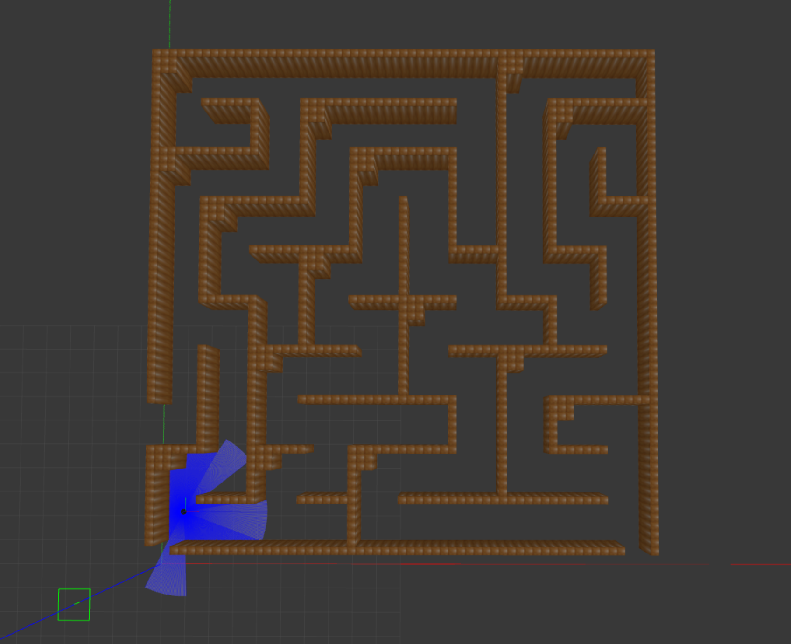
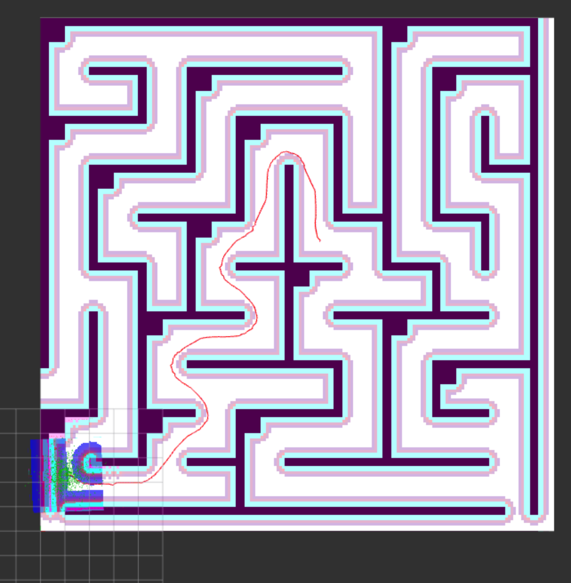
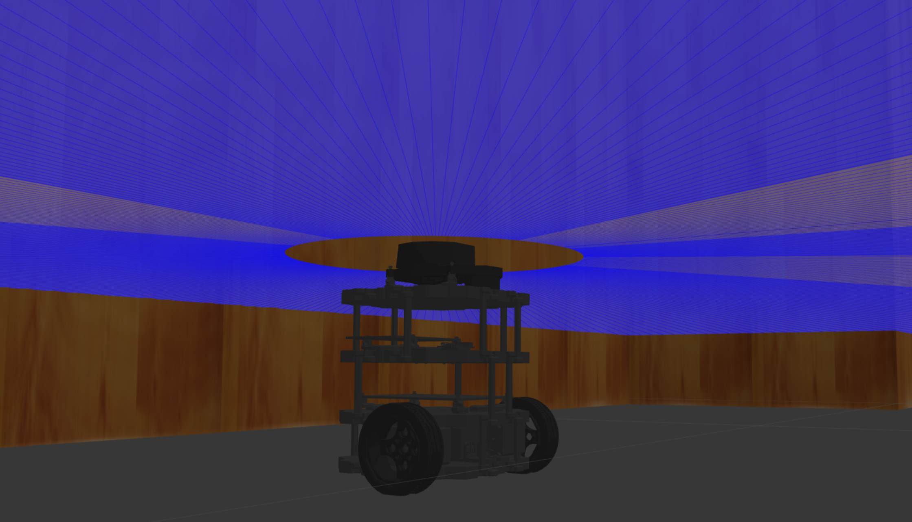
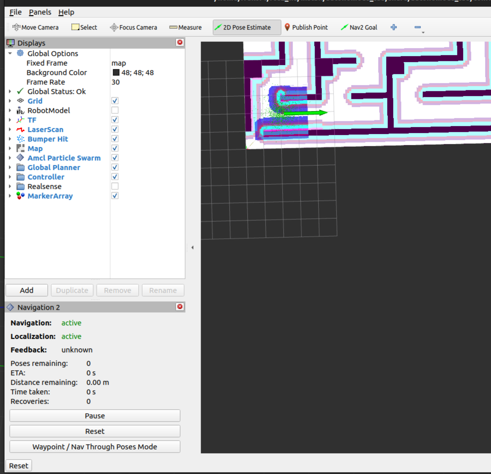
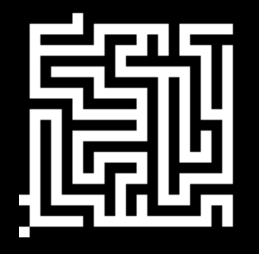
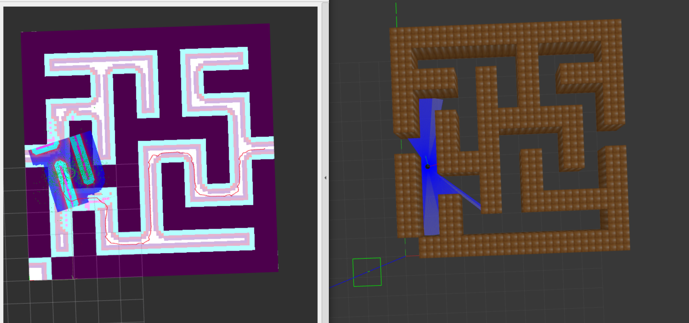
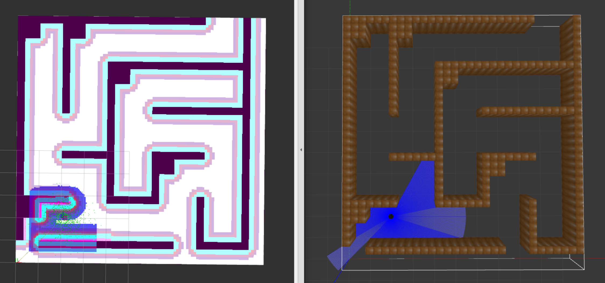

# Автономная навигация в пространстве с помощью лидара

## Требования к программному обеспечению
* Ubuntu 22.04 (LTS)
* Gazebo Classic
* ROS2 Humble
* библиотека SDL1.2
* библиотека Turtlebot3

## Описание проекта
Основа для проекта взята из [этого](https://github.com/Water1ock/Autonomous-Robots-Using-ROS2-Humble) открытого репозитория.

В проекте представлен автономный робот, который с помощью лидара определяет свою позицию в пространстве и, изначально зная карту лабиринта, добирается до выхода по кратчайшему маршруту (поиск пути осуществляется встроенным в Nav2 алгоритмом, об этом ниже). 


<table style="width: 100%;">
    <tr>
        <td style="width: 54%;">
            
            <br> <!-- Перенос строки -->
            <span style="font-size: italic; color: gray">вид в Gazebo</span>
        </td>
        <td style="width: 45%;">
            
            <br> <!-- Перенос строки -->
            <span style="font-size: italic; color: gray;">вид в RVis</span>
        </td>
    </tr>
</table>

<figure style="text-align: center; margin: 0;">
  
  <figcaption style="font-style: italic; color: gray;">TurtleBot3 - мобильный робот для ROS</figcaption>
</figure>


## Установка и запуск
1. Клонируйте репозиторий в папку src своего рабочего пространства ros
```bash
cd ~/ros2_ws/src
git clone https://github.com/71frukt/Robot_in_maze.git
cd ..
```

2. Скачайте и настройте Turtlebot3
```bash
sudo apt update
sudo apt install ros-humble-turtlebot3*

nano ~/.bashrc      # и в конец файла добавьте `export TURTLEBOT3_MODEL=burger`
```

3. Соберите проект
```bash
colcon build
```

4. Сгенерируйте рандомный лабиринт

    Запустите скрипт **~/ros2_ws/src/Robot_in_maze/autonomous_robot_pkg/autonomous_robot_pkg/maze_random_generate.py**

    Конфигурационные константы:

```python
MAZE_HEIGHT        = 10     # размеры лабиринта в клетках
MAZE_WIDTH         = 10

CELL_SIZE          = 1      # клетка = 1 x 1 метр
CELL_TO_WALL_RATIO = 3      # коридор в 3 раза шире стены
WALL_HEIGHT        = 2.5    # 2.5 метра в симуляции Gazebo
```

5. Запустите launch-файл
```bash
ros2 launch autonomous_robot_pkg maze_navigation.launch.py
```

6. Путь к выходу
    После загрузки Gazebo и RVis нужно указать роботу начальное положение и цель, к которой он должен следовать. 



<br>


* Кнопка **2D Pose Estimate** -> укажите оценочное положение робота;
* **Nav2 Goal** -> цель
* После этого Nav2 построит путь и направит по нему робота.


## Подробнее о генерации лабиринта

Скрипт генерации лабиринта - maze_random_generate. В основе лежит алгоритм поиска выхода из лабиринта вглубь DFS, только применяем этот алгоритм в обратную сторону, начиная из верхнего левого угла. 
Лабиринт - это двумерный массив maze. 1 - стена, 0 - коридор.

<details>
<summary>Алгоритм "прорезания" коридоров на псевдокоде (питоне)</summary>

```python
    def carve_pass(x, y):
        maze[y][x] = 0
        
        dirs = [(2, 0), (-2, 0), (0, 2), (0, -2)]   # "блок" стены имеет такой же размер, как комнаты, так что проходим через 2 блока
        random.shuffle(dirs)

        for dx, dy in dirs:
            new_x = x + dx
            new_y = y + dy
        
            if 1 <= new_x < blocks_count_x - 1 and 1 <= new_y < blocks_count_y - 1:
                if maze[new_y][new_x] == 1:
                    maze[y + dy // 2][x + dx // 2] = 0

                    carve_pass(new_x, new_y)

    # начать вырезать проход с угла
    carve_pass(blocks_count_y - 2, 1)
```

</details>

<br>

Лабиринт представляется полем N на M клеток, клетка может быть либо стеной, либо коридором. 
Мы рандомно выбираем одно из направлений, идем туда, и, если новая клетка еще не была посещена, прорубаем к ней проход. Затем рекурсивно повторяем то же самое. В результате получим лабиринт такого вида:

<figure style="text-align: center; margin: 0;">
  
  <figcaption style="font-style: italic; color: gray;">сгенерированный .pgm файл (коридор - белый)</figcaption>
</figure>

<br>

Используя сгенерированный двумерный массив maze, строим .sdf модель лабиринта для Gazebo.

Запустим проект и окажется, что робот теряется почти сразу, набегает неточность в определении положения робота в пространстве.

<figure style="text-align: center; margin: 0;">
  
  <figcaption style="font-style: italic; color: gray;">потеря маршрута</figcaption>
</figure>

<br>

Это связано с принципом работы AMCL (Adaptive Monte Carlo Localization). 

Шаги работы AMCL:

|                    |                                                                               |
|--------------------|-------------------------------------------------------------------------------|
| 1. Инициализация   | Вокруг стартовой точки распределяются частицы                                 |
| 2. Предсказание    | На основе одометрии частицы смещаются (модель движения робота)                |
| 3. Измерение       | Для каждой частицы симулируется скан по карте, сравнивается с ожидаемым       |
| 4. Взвешивание     | Каждая частица получает "вес" — насколько хорошо она объясняет наблюдение     |
| 5. Ресемплирование | Удаляются маловероятные частицы, дублируются хорошие (взвешенная выборка)     |

Если стена имеет толщину, сопоставимую с размером коридора, то погрешность ASML сильно возрастает, так как много позиций робота на перпендикуляре к стене в диапазоне толщины стены имеют одинаковый вес. К тому же, толстые стены ограничивают область видимости лидара.

### Утоньшение стен

Поэтому нужно переписать алгоритм так, чтобы стены были тоньше. Построим лабиринт по старому методу и сделаем тоньше те стены, которые можем. Будем проходиться по рядам двумерного массива = лабиринта. Сделать тонкой можем ту горизонтальную стену, в которой есть только арки и нет горизонтальных коридоров. Под аркой здесь подразумевается вертикальный коридор, который пересекает наш ряд в некоторой клетке. Такие ряды будем сужать. Аналогично проходимся по столбцам массива, и сужаем нужные стены. 

<details>
<summary>Алгоритм сужения стен по вертикали</summary>

```python
    for row_num in range(height - 2):
        can_be_thin = True

        for col_num in range(width - 2):
            if maze[row_num][col_num] == 0 and maze[row_num][col_num + 1] == 0:         # это не просто арка, а коридор
                can_be_thin = False
                break

        if can_be_thin:
            scaled_maze_row_num = row_num * scale
            
            for col_num in range(width - 1):
                scaled_maze_col_num = col_num * scale

                if maze[row_num][col_num] == 1 and maze[row_num + 1][col_num] == 1:     # если это стена и под ней стена, то по вертикали не сужаем
                    continue

                scaled_maze[scaled_maze_row_num + 1 : scaled_maze_row_num + scale, scaled_maze_col_num : scaled_maze_col_num + scale] = 0

```

</details>


Теперь лабиринт имеет такой вид и робот верно определяет свое положение в пространстве.




## О поиске маршрута к цели
В этом проекте используется стандартный планировщик Nav2, который строит граф из ячеек карты и по алгоритму Дейкстры ищет кратчайший путь от текущей позиции до цели. 

Принцип алгоритма основан на том, что мы рекурсивно для каждой вершины находим кратчайший путь. То есть изнчально расстояние то стартовой вершины - ноль, а до других вершин - бесконечность. Вот пример алгоритма Дейкстры на псевдокоде:

```
алгоритм Дейкстры(граф, старт):
    создать массив distances размером N (число вершин), заполнить все элементы бесконечностью    // массив кратчайших расстояний до точки старта
    создать массив parent размером N, заполнить -1 (неопределено)            // массив для восстановления пути. От финиша пойдем по вершинам из массива чтобы добраться до старта
    создать очередь с приоритетом (min-heap)    // здесь лежат вершины в порядке возрастания их расстояния до старта
    
    добавить в очередь (0, старт)
    cur_node = старт
    
    пока очередь не пуста:
        извлечь из очереди вершину next_node с минимальным расстоянием до cur_node
        
        если distances[next_node] > distances[cur_node]:
            пропустить

        cur_node = next_node

        для каждой вершины next_node, в которую есть ребро из cur_node с весом weight:
            new_distances = distances[cur_node] + weight
            
            если new_distances < distances[next_node]:
                distances[next_node] = new_weight
                parent[next_node] ← cur_node
                добавить в очередь (new_distances, next_node)
    
    ВЕРНУТЬ distances, parent
```

Алгоритм поиска выхода из лабиринта A* - это модифицированная версия алгоитма Дейкстры. Её отличие заключается в выборе next_node - учитывается расстояние от next_node до финиша, и в очереди лежат вершины не просто в порядке уменьшения weight (weight - вес ребра соединяющего next_node и cur_node). Для определения веса вершины в очереди используется монотонная функция h(node), которая характеризует расстояние от node до финиша, и тогда вес вершины node в очереди = weight + h(node).


<!-- 


Про то как подгрузить нужные модели

```bash
cd ros_ws/src/autonomous_robot_pkg
export GAZEBO_MODEL_PATH=$GAZEBO_MODEL_PATH:<path to gazebo_models_worlds_collection>/models
``` -->